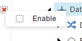
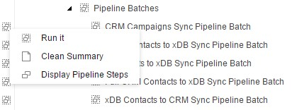
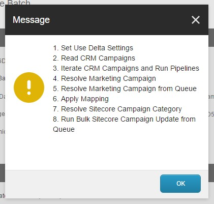
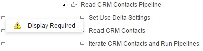
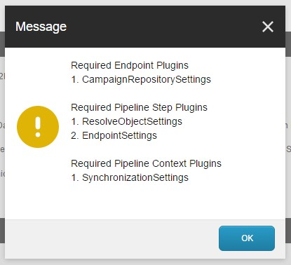

# Gutters for Sitecore Data Exchange Framework

One interesting and cool feature of Sitecore is the ability to use gutters. What more interesting is creating custom gutters. Sitecore gutters can be a very useful way of providing a quick solution for context item of an item within the tree.

The current solutions were designed mainly for [Sitecore Data Exchange Framework](https://dev.sitecore.net/Downloads/Data_Exchange_Framework.aspx) (DEF) and its providers. If you are not familiar with DEF, please follow the available [documentation link](http://integrationsdn.sitecore.net/DataExchangeFramework/v1.2/).

There are three available gutters for DEF.

- [Gutters for Sitecore Data Exchange Framework](#gutters-for-sitecore-data-exchange-framework)
    - [DataExchange - Item Disabled](#dataexchange---item-disabled)
    - [DataExchange - Pipeline Batch](#dataexchange---pipeline-batch)
    - [DataExchange - Pipeline Step](#dataexchange---pipeline-step)
- [Downloads](#downloads)
- [Contributors](#contributors)

### DataExchange - Item Disabled

By default when you configure a new tenant with its batches and pipeline steps they are disabled. This gutter allows not only see it, also, it allows you to set as enabled.

### DataExchange - Pipeline Batch

When you select pipeline batch you have several options:

- **Run It** - allows you to run selected pipeline batch.
- **Clean Summary** - allows you to clean up data under summary section.
- **Display Pipeline Steps** - allows to display chain of pipeline steps for current batch.

### DataExchange - Pipeline Step

There is a single option for selected pipeline step is to **display required plugins**.

# Downloads

_Right click 'Save link as...' since GitHub doesn't respect url encoding, but markdown needs it for formatting in this readme ;-)_

- [Gutters for Sitecore Data Exchange Framework 1.0.0 rev. 170202](./source/packages/Gutters%20for%20Sitecore%20Data&20Exchange%20Framework%201.0.0%20rev.%20170202.zip) (pre Sitecore 9.3)
- [Gutters for Sitecore Data Exchange Framework-Sitecore 9.3.0 for DEF 4.0.0](./source/packages/Gutters%20for%20Sitecore%20Data%20Exchange%20Framework-Sitecore%209.3.0%20for%20DEF%204.0.0.zip)
- [Gutters for Sitecore Data Exchange Framework-Sitecore 10.0.0 for DEF 5.0.0](./source/packages/Gutters%20for%20Sitecore%20Data%20Exchange%20Framework-Sitecore%2010.0.0%20for%20DEF%205.0.0.zip)

# Contributors

_Originally developed by:_

Vlad Shpak - Twitter: [@vladcheg](https://twitter.com/vladcheg), GitHub: https://github.com/vladcheg

_Upgraded to Sitecore 9.3 (DEF 4.0.0), Sitecore 10 (DEF 5.0.0) + introduced Unicorn_

Robbert Hock - Twitter: [@kayeeNL](https://twitter.com/kayeenl), GitHub: https://github.com/KayeeNL
